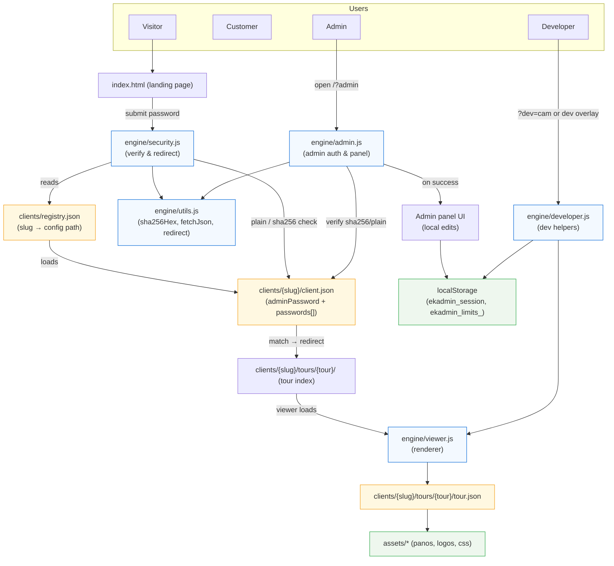

# User groups → file flow

Diagram showing how different user groups (Visitor, Customer, Admin, Developer) interact with the app and which files/modules are involved.

> Notes:
- `engine/security.js` performs the landing password lookup and redirects to `clients/<slug>/tours/<tour>/` on success.
- Admin auth uses `engine/admin.js` and the `adminPassword` field in `clients/<slug>/client.json`.
- Developer helpers live in `engine/developer.js` and persist tweaks to `localStorage`.

---

File: `docs/diagrams/user-groups-file-flow.md` — open it to view or edit the diagram.